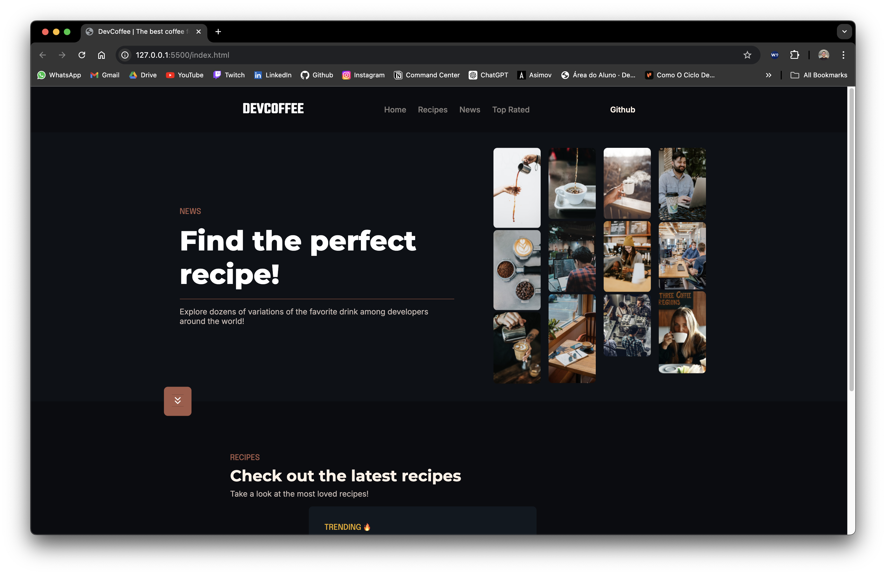
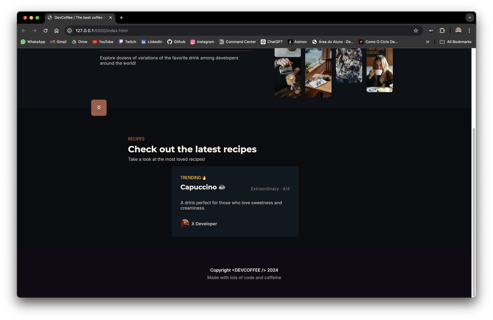

# My Landing Page Project

This project is a landing page I created to practice my HTML and CSS skills. It showcases a clean, responsive design based on a template inspired by Rafaella Ballerini's profile, demonstrating my knowledge of basic web development technologies.

## Overview

Here is a preview of the page:




## How to Run the Project

1. Clone this repository:
   ```bash
   git clone https://github.com/Victor-Amarante/devcoffee-landing-page.git
